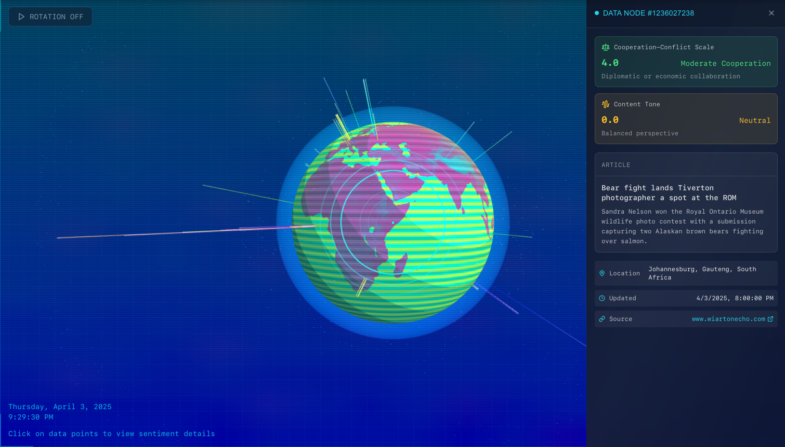

# GDELT Events 3D Visualization



An interactive 3D visualization that maps real-time global events from the GDELT database onto a stylized Earth model.

---

## Features

- **3D Globe Visualization:** Rendered with Three.js.
- **Event Data:** Queries GDELT via BigQuery for event details.
- **Data:** Extracts article metadata and fetches location images from Wikipedia.
- **Interactive UI:** Hover tooltips and click-to-view details.
- **Dynamic Effects:** Animated satellites, particles, and overlay effects.

---

## Getting Started

### Prerequisites

- **Node.js** (v14+)
- **npm**

### Installation

1. **Clone the Repository:**
   ```bash
   git clone https://github.com/annsts/gdelt-events-viz.git
   cd gdelt-events-viz
   ```

2. **Install Dependencies:**
   ```bash
   npm install
   ```

3. **Configure Environment Variables:**

   Create a `.env` file in the root directory with the following content:

   ```env
   # BigQuery Credentials
   CREDENTIALS_FILE=your-bigquery-credentials.json
   ```

   Place your BigQuery credentials file in the `src/app/` directory or update the path in the code accordingly.

---

## Running the Project

Start the development server:

```bash
npm run dev
```

Then open [http://localhost:3000](http://localhost:3000) in your browser to view the application.

---

## Project Structure

- **Frontend:** React/Next.js components for UI and 3D rendering.
- **3D Visualization:** Utilizes Three.js for rendering the globe, markers, and dynamic effects.
- **Server-side:** API routes that query BigQuery, process event data, and handle caching.
